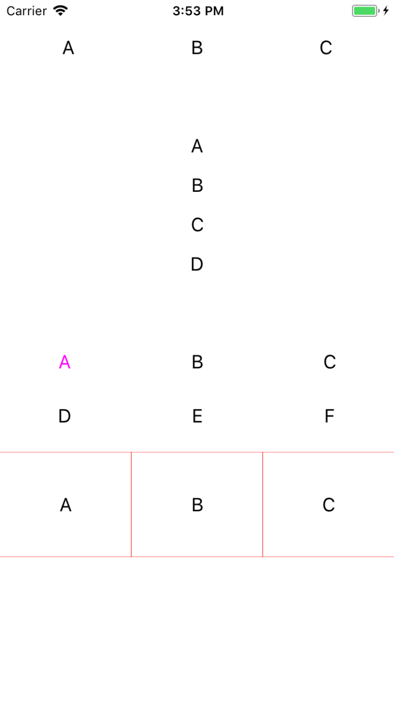

# KUIButtonBar


[](http://cocoapods.org/?q=name%3AKUIButtonBar%20author%3AKofktu)
[](https://github.com/Carthage/Carthage)

- Simple Component for Multi Buttons



## Requirements
- iOS 8.0+
- Swift 4.0

## Installation

#### CocoaPods
KUIButtonBar is available through [CocoaPods](http://cocoapods.org). To install
it, simply add the following line to your Podfile:

```ruby
pod 'KUIButtonBar'
```

#### Carthage
For iOS 8+ projects with [Carthage](https://github.com/Carthage/Carthage)

```
github "Kofktu/KUIButtonBar"
```

## Usage

#### KUIButtonBarConfig

```swift
public struct KUIButtonBarConfig {
    public var toggle: Bool
    public var rowCount: Int
    public var columnCount: Int  // numberOfButtons 하기전에 값 설정해놓을것
    public var numberOfButtons: Int
    public var horizontalGap: CGFloat
    public var verticalGap: CGFloat
    public var defaultSelectedIndex: Int // toggle 값이 true 인 경우에만 KUIButtonBar refresh시 기본값으로 설정됨

```

#### KUIButtonBarDelegate

```swift
protocol KUIButtonBarDelegate {
    // Required
    func render(_ buttonBar: KUIButtonBar, button: UIButton, index: Int)
    
    // Optional
    optional func click(_ buttonBar: KUIButtonBar, button: UIButton, index: Int)
    optional func selected(_ buttonBar: KUIButtonBar, button: UIButton, index: Int)
}

```

## Authors

Taeun Kim (kofktu), <kofktu@gmail.com>

## License

KUIButtonBar is available under the ```MIT``` license. See the ```LICENSE``` file for more info.